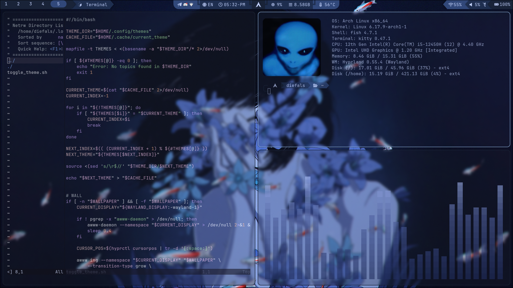
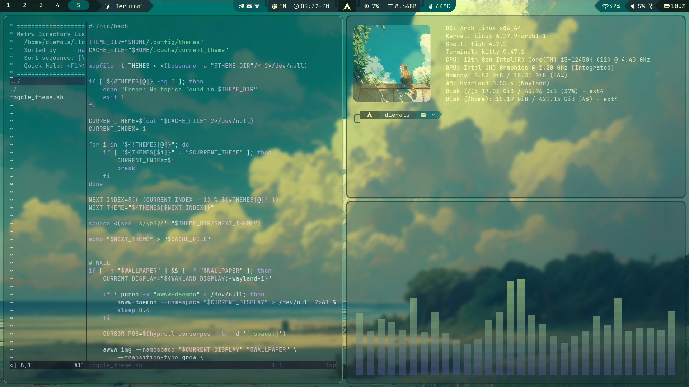
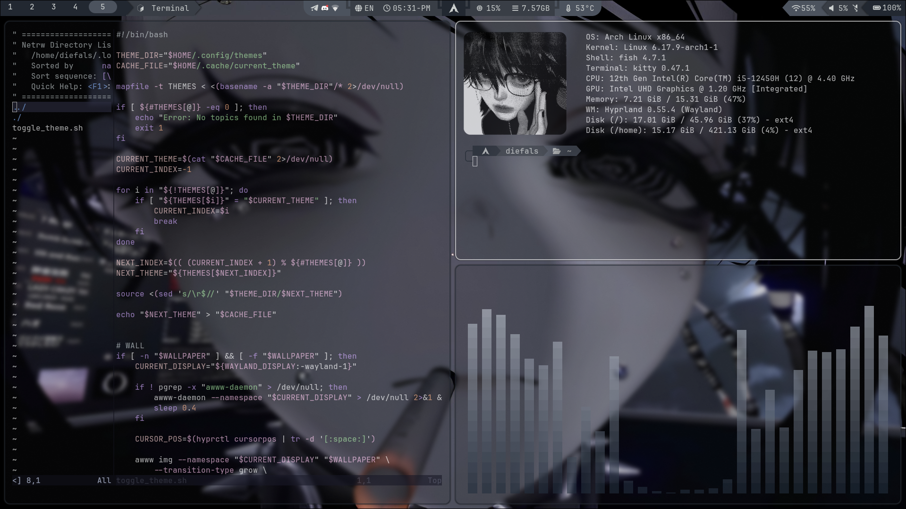
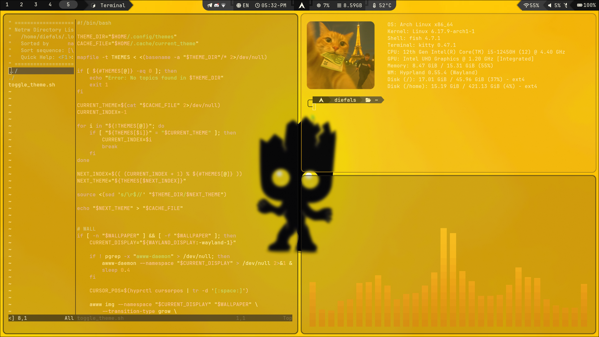

# 🛠 Aw1ks' Dotfiles

My personal desktop environment configuration based on the distribution **Arch Linux** and a tiling window manager **Hyprland**. The configuration manager is used to manage and synchronize settings files. [chezmoi](https://github.com/twpayne/chezmoi).

---

## 💻 System Specification

The table below lists the key components of the environment and the software used. This configuration is optimized for the specified stack.

| Component | Software | Purpose / Description | Link |
| :--- | :--- | :--- | :--- |
| operating system | Arch Linux | Basic distribution Linux | [archlinux.org](https://archlinux.org) |
| Window manager | Hyprland (v0.52.2) | Wayland-composer with tiling window organization | [hyprland.org](https://hyprland.org) |
| Terminal emulator | Kitty | Basic GUI-terminal with hardware acceleration support | [github.com/kovidgoyal/kitty](https://github.com/kovidgoyal/kitty) |
| Command shell | Fish | Interactive shell with convenient autocompletion and highlighting | [fishshell.com](https://fishshell.com) |
| Text editor | Neovim + [LazyVim](https://www.lazyvim.org) | The main environment for text development and editing (Lua/Scheme) with configuration LazyVim | [neovim.io](https://neovim.io) |
| Status panel | Waybar | Customizable dashboard for Wayland | [github.com/Alexays/Waybar](https://github.com/Alexays/Waybar) |
| Launch interface | Wofi | A utility for launching applications and creating menus (menus/launcher) | [github.com/Cantara/wofi](https://github.com/Cantara/wofi) |
| Configuration management | [Chezmoi](https://chezmoi.io) | Dotfiles Management and Synchronization Manager | [chezmoi.io](https://chezmoi.io) |

---

## 🔧 Important clarifications regarding Hyprland configuration

This configuration uses Hyprland version 0.52.2, so the primary configuration file is in the .conf format.
Starting with Hyprland versions 0.55 and higher, it is recommended to update configurations and write them in Lua. These will require modifications and migration of .conf files to .lua files.

---

## 📸 Preview

<p align="center">
  <video src="./screenshots/preview_video.mp4" width="100%" controls autoplay muted loop>
    Your browser does not support embedded video.
  </video>
  <br>
  <i>A short video demonstration of animations and visual components</i>
</p>

### 🎨 Custom themes
The build includes four pre-built color profiles. Switching between them adapts the entire system's color gamut.

| **Theme: Blue** | **Theme: Green** |
| :---: | :---: |
|  |  |
| **Theme: Gray** | **Theme: Yellow** |
|  |  |

---

## 🚀 Configuration Deployment

Instructions for installing the environment on a clean system (assuming Arch Linux is used).

### 1. Installing dependencies

Before applying configuration files, make sure that the target programs and management utility are installed on the system:

```bash
sudo pacman -S git chezmoi hyprland kitty fish neovim waybar wofi
```
### 2. Installing dotfiles (Recommended secure method)

To avoid accidentally overwriting your personal important files, first download the repository and view the diff:

# Downloading the configuration to a temporary local repository
```bash
chezmoi init --repo-url https://github.com/Aw1ks/dotfiles

# View the changes that will be made to your system
chezmoi diff
```

If you are satisfied with the changes and are ready to apply them to your system, follow these steps:

```bash
chezmoi apply
```

### 3. Quick installation (on a clean system)

If you are deploying a system from scratch and want to apply all settings instantly with one command:

```bash
chezmoi init --apply --repo-url https://github.com/<ваш-репозиторий>
```

### Manual installation (if necessary)

If you want to copy the configuration files manually, the dot_config folder corresponds to your local ~/.config/ directory, and dot_local/bin corresponds to the ~/.local/bin/ directory. More details on the structure are in the next section.

---

## 📁 Repository structure

The project is organized according to chezmoi standards. Below is a directory tree describing the target components and new additions:
├── dot_config/                # Analogue of the `~/.config/` directory
│   ├── fish/                  # Fish Shell Configuration
│   ├── hypr/                  # Hyprland Wayland Composer Settings
│   ├── kitty/                 # Kitty Terminal Emulator Configuration
│   ├── nvim/                  # Custom Neovim + LazyVim build
│   ├── waybar/                # Status Bar Styles and Layout
│   ├── wofi/                  # Launcher Themes and Options
│   └── themes/                # Custom themes for utilities and interface
├── dot_local/                 # Analogue of the `~/.local/` directory
│   └── bin/                   # Custom automation scripts
├── Terminal_img/              # Images and logos for terminal output
└── Themes_wall/               # Wallpaper collection
